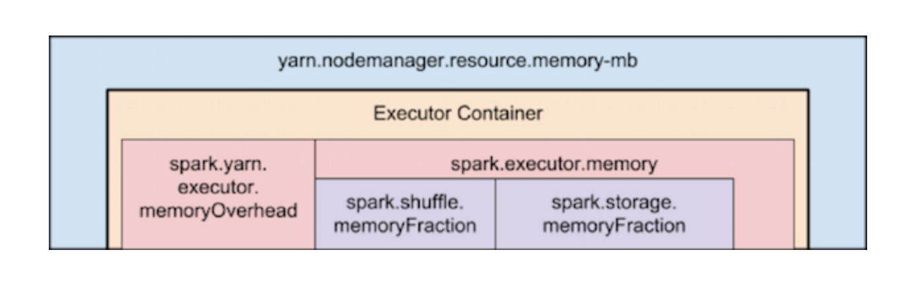

# Start Spark Cluster

This is a sample tutorial on how to get set up a scalable cluster with Apache Spark. At the moment, this can reliably support upto 3 workers, beyond which the cluster is a bit unstable, i.e. workers successfully get created and connected to master, but the spark job can get hanged. Anyways, 3 is a decent number of workers for most student requirements. I will keep updating as I make progress.

The docker-compose.yml refers to two important properties, namely ports and expose:

1. Ports mentioned will be shared among different services started by the docker-compose. Ports will be exposed to the host machine to a random port or a given port. Activates the container to listen for specified port(s) from the world outside of the docker(can be same host machine or a different machine) AND also accessible world inside docker.

2. Expose basically "exposes" ports without publishing them to the host machine - they’ll only be accessible to linked services. Only the internal port can be specified. Activates container to listen for a specific port only from the world inside of docker AND not accessible world outside of the docker.

Spark Master is an application that coordinates resources allocation from slaves. Master does not perform any computations. Master is just a resource manager. And Spark worker is application on worker node which coordinates resources on a given worker node. Finally, Spark executor is application created by spark worker which performs tasks on worker node for driver.

	./build_cluster.sh

Before I used a load balancer, Master was running at localhost:8080 and workers were be running at localhost:8081, localhost:8082 and localhost:8083 respectively (refer to screenshots folder). I had to  manually copy pasted configurations in the docker-compose.yml file for each worker. And the Docker "scale" command is deprecated in version 3, and we cannot use "replicas" option in "deploy" setting of the docker-compose.yml file because it only takes effect when deploying to a swarm with docker stack deploy, and is ignored by docker-compose up and docker-compose run.

# Running Spark Applications

At the top of the execution hierarchy are Spark jobs. Invoking an action inside a Spark application triggers the launch of a Spark job to fulfill it. The execution plan consists of assembling the job’s transformations into stages. A stage corresponds to a collection of tasks that all execute the same code, each on a different subset of the data. Each stage contains a sequence of transformations that can be completed without shuffling the full data. 

An RDD comprises a fixed number of partitions, each of which comprises a number of records. For the RDDs returned by so-called narrow transformations like map and filter, the records required to compute the records in a single partition reside in a single partition in the parent RDD. Each object is only dependent on a single object in the parent. In wide transformation like groupByKey and reduceByKey, the data required to compute the records in a single partition may reside in many partitions of the parent RDD. All of the tuples with the same key must end up in the same partition, processed by the same task. 

At each stage boundary, data is written to disk by tasks in the parent stages and then fetched over the network by tasks in the child stage. Because they incur heavy disk and network I/O, stage boundaries can be expensive and should be avoided when possible. Just as the number of reducers is an important parameter in tuning MapReduce jobs, tuning the number of partitions at stage boundaries can often make or break an application’s performance. And the primary goal when choosing an arrangement of operators is to reduce the number of shuffles and the amount of data shuffled, because shuffles are expensive. But there is an occasional exception to the rule of minimizing the number of shuffles. But an extra shuffle can be advantageous to performance in an exceptional case when it increases parallelism.

We connect to the docker container running the Master as follows:

	docker exec -it spark-on-docker_master_1 /bin/bash 

Language choice for programming in Apache Spark depends on the features that best fit the project needs, as each one has its own pros and cons. Python is more analytical oriented while Scala is more engineering oriented but both are great languages for building Data Science applications. 

## Scala Examples

Scala is a statically typed language which allows us to find compile time errors. Spark is written in Scala as it can be quite fast because it's statically typed and it compiles in a known way to the JVM. Scala is frequently over 10 times faster than Python. Moreover Scala is native for Hadoop as its based on JVM. Hadoop is important because Spark was made on the top of the Hadoop's filesystem HDFS. Scala interacts with Hadoop via native Hadoop's API in Java. That's why it's very easy to write native Hadoop applications in Scala. Scala may be a bit more complex to learn in comparison to Python due to its high-level functional features. But Scala is always more powerful in terms of framework, libraries, implicit, macros etc. And Scala works well within the MapReduce framework because of its functional nature. 
	
	#1. Calculate the Value of Pi
		bin/run-example SparkPi 10

	#2. Linear regression with elastic-net (mixing L1/L2) regularization
		bin/run-example ml.LinearRegressionExample --regParam 0.15 --elasticNetParam 1.0 data/mllib/sample_linear_regression_data.txt

## Python Examples

Python is dynamically typed and this reduces the speed and makes it higly prone to bugs every time you make changes to the code. Compiled languages are faster than interpreted.  Spark libraries have to called which require a lot of code processing and hence slower performance. Python interacts with Hadoop services very badly, so developers have to use 3rd party libraries (like hadoopy). But Python has simple syntax and good standard libraries, so it is preferable for simple intuitive logic whereas Scala is more useful for complex workflows. Especially for complex machine learning applications like NLP, Graphs and visualization, Python is preferred as Scala doesn’t have many tools for it. 

	#1. Calculate the number of words in a text file
		bin/spark-submit examples/src/main/python/wordcount.py data/mllib/images/license.txt

	#2. Calculate the Pagerank for a bunch of web page urls 
		bin/spark-submit examples/src/main/python/pagerank.py data/mllib/pagerank_data.txt 10

	#3. Demonstrate K-means clustering and calculate euclidian distance (requires numpy)
		bin/spark-submit examples/src/main/python/ml/kmeans_example.py

	#4. An ML Pipeline which consists of three stages: tokenizer, hashingTF, and logistic regression.
		bin/spark-submit examples/src/main/python/ml/pipeline_example.py

	#5. A Multilayer Perceptron Classifier with four layers (4,5,4,3): 
		bin/spark-submit examples/src/main/python/ml/multilayer_perceptron_classification.py

## We may have to run some commands on worker container (install new packages)
	
	docker exec -it spark-on-docker_worker_1 /bin/bash

	#After worker container starts, we can access its shell and post commands
		pip install numpy

# Tuning our Spark jobs

The two main resources that Spark (and YARN) think about are CPU and memory. Every Spark executor in an application has the same fixed number of cores and same fixed heap size. The cores property controls the number of concurrent tasks an executor can run. The memory property impacts the amount of data Spark can cache, as well as the maximum sizes of the shuffle data structures used for grouping, aggregations, and joins. Running executors with too much memory often results in excessive garbage collection delays. In the industry, 64GB is a rough guess at a good upper limit for a single executor. And the HDFS client has trouble with tons of concurrent threads, so at most 5 tasks per executor can achieve full write throughput. Spark is a parallel processing engine, but is limited in its ability to figure out the optimal amount of parallelism. 
Every Spark stage has a number of tasks, each of which processes data sequentially. In tuning Spark jobs, this number is probably the single most important parameter in determining performance. This number determined by the way Spark groups RDDs into stages. 

The number of tasks in a stage is the same as the number of partitions in the last RDD in the stage. The number of partitions in an RDD is the same as the number of partitions in the RDD on which it depends. And for RDDs with no parents (RDDs produced by textFile or hadoopFile)have their partitions determined by the underlying MapReduce InputFormat that’s used. The primary concern is if the number of tasks is too small, then there are fewer tasks than slots available to run them in, the stage won’t be taking advantage of all the CPU available. A small number of tasks also mean that more memory pressure is placed on any aggregation operations that occur in each task. When the records destined for these aggregation operations do not easily fit in memory, some mayhem can ensue. First, holding many records in these data structures puts pressure on garbage collection, which can lead to pauses down the line. Second, when the records do not fit in memory, Spark will spill them to disk, which causes disk I/O and sorting.  This overhead during large shuffles is probably the number one cause of job stalls in the at industry. The in-memory size of the total shuffle data is hard to determine. The closest heuristic is to find the ratio between Shuffle Spill (Memory) metric and the Shuffle Spill (Disk) for a stage that ran. Then multiply the total shuffle write by this number. 

Data flows through Spark in the form of records. A record has two representations: a deserialized Java object representation and a serialized binary representation. In general, Spark uses the deserialized representation for records in memory and the serialized representation for records stored on disk or being transferred over the network. The footprint of your records in these two representations has a massive impact on Spark performance. Bloated deserialized objects will result in Spark spilling data to disk more often and reduce the number of deserialized records Spark can cache (e.g. at the MEMORY storage level). Bloated serialized objects will result in greater disk and network I/O, as well as reduce the number of serialized records Spark can cache (e.g. at the MEMORY_SER storage level).

## SequenceFile

Whenever you have the power to make the decision about how data is stored on disk, use an extensible binary format like Avro, Parquet, Thrift, or Protobuf. Pick one of these formats and stick to it. To be clear, when one talks about using Avro, Thrift, or Protobuf on Hadoop, they mean that each record is a Avro/Thrift/Protobuf struct stored in a sequence file. JSON is just not worth it because a lot of energy will be wasted to power the CPU cycles spent parsing your files over and over and over again. Sequence files are binary files containing key-value pairs. They can be compressed at the record (key-value pair) or block levels. A Java API is typically used to write and read sequence files but a tool like Apache Sqoop can be used to convert to sequence files. Because they are binary, they have faster read/write than text-formatted files.

The small file problem arises when many small files cause memory overhead for the namenode referencing large amounts of small files. The concept of SequenceFile is to put each small file to a larger single file. For example, suppose there are 10,000 files of size 100KB, then we can write a program to put them into a single SequenceFile like above, where you can use filename to be the key and content to be the value. Sequence file is written to hold multiple key-value pairs and the key is a unique file metadata, like ingest filename or filename+timestamp and value is the content of the ingested file. Now you have a single file holding many ingested files as splittable key-value pairs. So if you loaded it into pig or hive, and grouped by key, then each file content would be its own record.

## Scaling our Workers

We can use the --scale flag while doing docker-compose up, but it initially gave me errors that "port is already allocated" as I could not statically assign ports to workers that were dynamically created. They were all automatically getting assigned to port 80 as mentioned in the docker-compose file, and because that port is already occupied, the container was failing. So what I did is I set up a Traefik reverse-proxy container which is a load balancer, and and expose my worker containers ports to the load balancer which will handle our scaling issues. In the future, I am trying to use a Redis Database, which is often referred as a *data structures* server. So different processes can query and modify the mutable data structures in a shared way. You'll need to use a Redis client to connect to Redis, not your browser. It can have some interesting application for our Spark cluster.

# Stop and Remove all running containers

Docker provides tools to stop and remove containers as given below

	docker stop $(docker ps -a -q)
	docker rm $(docker ps -a -q)

## Clean up network

Despite stopping and removing previous containers, you may get issues like "port is already allocated". So it is good practice to run this command as it removes previously used networks. You may have to restart Docker desktop if issue still persists.

	docker-compose down
